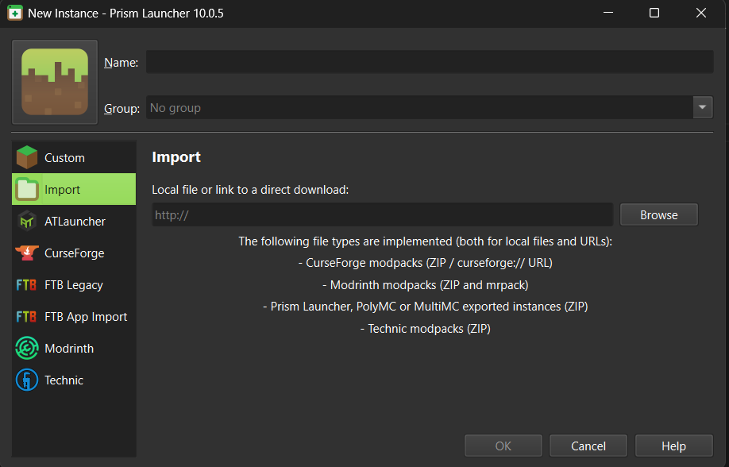

# Minecraft Server Setup

A collection of server/client modpacks for use by me and my friends, with documentation for people new to modded Minecraft and anyone who wants to host their own server.

---

# Contents

- [Player Quick Start](#player-quick-start) - quickstart to join a server
- [Modpacks](#modpacks) - what's in the server-side and client-side packs
- **[server/SERVER_SETUP.md](server/SERVER_SETUP.md)** - end-to-end guide to host your own server on Oracle Cloud (free)
- **[client/CLIENT_SETUP.md](client/CLIENT_SETUP.md)** - friend-facing guide to join a server with Prism Launcher

---

# Player Quick Start

1. Download a mod launcher, I recommend [Prism Launcher](https://prismlauncher.org/download/windows/).
2. Pick the modpack you want and download the matching `.mrpack` file from the `client/` folder.
3. Create a new instance in your mod launcher.
   
4. Import the downloaded `.mrpack` file.
   
5. Launch the instance, then connect to the server with the IP from the host.
6. Once you join, do `/register <pw> <pw>` to connect a password to your username. Do `/login <pw>` on future sessions.

---

# Modpacks

For full descriptions of any mod on this list, visit [Modrinth](https://modrinth.com) or Google the mod name.

## Server-side

### Vanilla+
The most basic set of server-side mods for a Vanilla+ Minecraft experience with your friends. This modpack is extremely lightweight, mainly performance/optimization mods plus multiplayer QoL: sitting, sleep speed-up, proximity voice chat, player head drops.

People playing on a Vanilla+ modpack server do **not** *need* to install any mods themselves to connect, though installing Simple Voice Chat is strongly recommended.

**Full mod list:**
- **Performance:** Lithium, Krypton, FerriteCore, ModernFix, Noisium, ScalableLux, C2ME (Concurrent Chunk Management Engine), Alternate Current, ServerCore, spark, View Distance Fix
- **Worldgen / LOD:** Voxy, Voxy Server Side, Voxy WorldGen V2
- **Gameplay:** Sit, Sleep Warp, Let Me Despawn, Get It Together Drops, Clumps, Just Player Heads, Playtime Command
- **Admin / Utility:** LuckPerms, TAB (Fabric Tab List), Placeholder API, Chunky, EasyAuth
- **Voice:** Simple Voice Chat (server side)
- **Networking:** Raknetify (Fabric)
- **Libraries:** Fabric API, Fabric Language Kotlin, Architectury, Cloth Config, Fzzy Config, MidnightLib, TCDCommons API, YetAnotherConfigLib, Config Manager, Almanac, Collective

## Client-side

### Vanilla+
The most basic set of client-side mods — should be used if the server uses Vanilla+, but also works for **a better singleplayer experience**. Mostly client-side counterparts to the Vanilla+ server mods, plus QoL features like FPS display, waypoints, zoom, dynamic lighting, and better shulker boxes.

**Full mod list:**
- **Enables Vanilla+ server features:** **Simple Voice Chat**, AppleSkin, Voxy
- **Performance:** Sodium, Lithium, FerriteCore, ModernFix, ImmediatelyFast, EntityCulling, Cull Fewer Leaves, Dynamic FPS, Particle Core, Fast Noise
- **Visual / QoL:** Iris, LambDynamicLights, Sound Physics Remastered, Zoomify, Fabrishot, Flashback, Fadeless
- **UI tweaks:** Mod Menu, Controlling, Shulker Box Tooltip, Status Effect Bars, Toggle Nametags, FPS-Display, World Play Time, wWaypoints
- **Misc:** No Telemetry, Crash Assistant
- **Libraries:** Fabric API, Fabric Language Kotlin, Architectury, Cloth Config v20, YetAnotherConfigLib, MidnightLib, Fzzy Config, TCDCommons API, Config Manager
- **Optional:** ViaFabricPlus (download this if you want to play on a server that runs a different Minecraft version than your client)

---

# Hosting your own server

See [`server/SERVER_SETUP.md`](server/SERVER_SETUP.md) for the full end-to-end Oracle Cloud walkthrough — VM creation, firewall config, modpack install, EasyAuth, daily backups, and restoring from a backup. Plan ~45–60 minutes once your Oracle account is approved.

# Joining a server (for friends)

See [`client/CLIENT_SETUP.md`](client/CLIENT_SETUP.md) for the Prism Launcher walkthrough.
